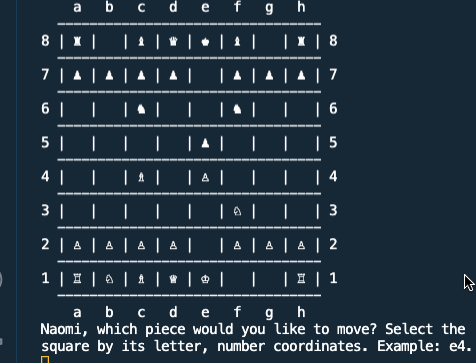

# Chess

This terminal-based chess game was developed as part of The Odin Project's [Ruby on Rails Curriculum](http://www.theodinproject.com) as the final Ruby project.

Play on [repl.it](https://repl.it/@naomiflagg/chess).

